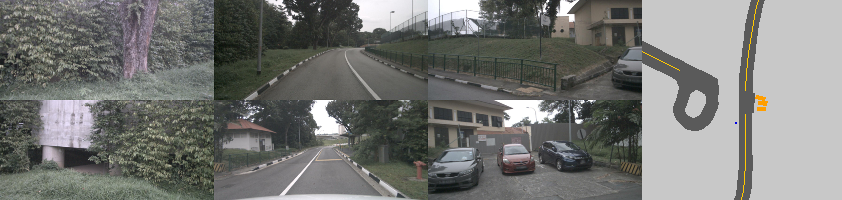

## Credits

- Original Project: [CoBEVT GitHub](https://github.com/LeadingLab/CoBEVT)  
- Dataset: [NuScenes](https://www.nuscenes.org/)

## Setup

- Ubuntu 24.04
- GPU: NVIDIA GeForce RTX 4070
  
## Installation

1. Clone the repository:
```bash
git clone https://github.com/DerrickXuNu/CoBEVT.git
cd CoBEVT-Demo/nuscenes
```


2. Create a Conda Environment and Download all the Dependencies
 ```bash
conda create -n sinbevt python=3.8
conda activate sinbevt
pip install -r requirements.txt
```

Refer Credits (CoBEVT) for Dependency & Compatible Setup

3. Inference
 ```bash
python3 scripts/view_data.py   data=nuscenes   data.dataset_dir=/CoBEVT/media/datasets/nuscenes   data.labels_dir=/CoBEVT/media/datasets/cvt_labels_nuscenes_v2   data.version=v1.0-mini   visualization=nuscenes_viz   +split=val
 ```

4. Results



